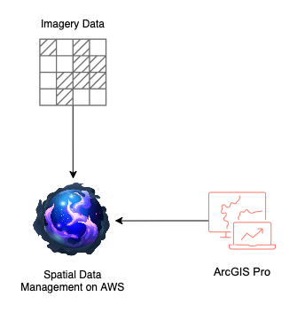

# ArcGIS Pro Connector for SDMA

[](https://pro.arcgis.com/)
[](https://dotnet.microsoft.com/)
[](LICENSE)

SdmaConnector is a powerful ArcGIS Pro add-in that provides seamless integration with Spatial Data Management on AWS (SDMA), a cloud-based geospatial data management platform. The add-in enables GIS professionals to browse, explore, manage, and reference SDMA projects, assets, and files directly from within ArcGIS Pro.


## 🌟 Key Features

### 📁 **Project & Asset Management**
- **Hierarchical Browser**: Navigate through SDMA projects, assets, and files in an intuitive tree view with folder structure support
- **Real-time Authentication**: Secure CLI-based login with session management
- **Detailed Metadata**: Rich information display including statistics, timestamps, and technical details
- **Native Integration**: Seamless dockpane integration within ArcGIS Pro interface
- **Resizable Panes**: Adjustable splitter between project explorer and details pane
- **Smart Icons**: Dynamic folder and project icons that change when expanded/collapsed

### 🔗 **File Reference System**
- **Smart Field Creation**: Automatically adds SDMA reference fields to feature classes and tables
- **Flexible Workflow**: Reference SDMA files from any feature or table row
- **Rich Metadata Storage**: Stores project names, asset names, file names, S3 locations, and more
- **Context Menu Integration**: Right-click workflows for adding and accessing references
- **Folder Structure Support**: Files organized in folders display correctly in tree hierarchy

### 🖼️ **Enhanced Image Preview**
- **Advanced Viewer**: Professional image preview with pan and zoom capabilities
- **Universal Panning**: Click and drag at any zoom level including fit-to-window
- **Smart Zoom Controls**: Mouse wheel + Ctrl for precise zooming centered on cursor
- **Download Support**: Direct file download with progress tracking
- **Multiple Formats**: Support for JPG, PNG, GIF, BMP, TIFF, and more

### 📊 **Table Integration**
- **Context Menu Access**: Right-click in attribute tables to open SDMA file links
- **Smart Detection**: Automatically detects tables with SDMA reference fields
- **Batch Operations**: Open multiple file links from selected table rows
- **Seamless Workflow**: Works with both feature layers and standalone tables

## 🚀 Getting Started

### Prerequisites

- **ArcGIS Pro 3.5+** (minimum version 3.5)
- **.NET 8.0** targeting Windows
- **SDMA Portal & CLI** installed and configured
- **AWS credentials** configured for SDMA access

### Installation

1. **Download** the latest release from the releases page
2. **Close ArcGIS Pro** if it's currently running
3. **Double-click** the `.esriAddinX` file to install
4. **Launch ArcGIS Pro** and open any project
5. **Look for the SDMA tab** in the ribbon or find "Project Explorer" in the Add-In tab

### First Time Setup

1. **Open the SDMA Project Explorer** from the Add-In tab
2. **Click the login button** - this will authenticate with SDMA CLI
3. **Browse your projects** in the hierarchical tree view
4. **Start adding references** to your GIS data

## 📖 User Guide

### Basic Workflow

#### 1. **Browse SDMA Content**
```
Project Explorer → Login → Navigate Projects → Explore Assets → View Files
```

#### 2. **Add File References to GIS Data**
```
Select Layer/Table → Right-click Spatial Data Management File → "Add Reference to Feature Class/Table"
```

#### 3. **Access Referenced Files**
```
Open Attribute Table → Select Rows → Right-click → "Open SDMA Links"
```

### Detailed Instructions

#### **Adding SDMA References**


1. **Prepare Your Data**
   - Open a map with feature layers or standalone tables
   - Select the target layer/table in the Contents pane

2. **Select SDMA File**
   - Navigate to desired file in SDMA Project Explorer
   - Right-click on the file
   - Choose "Add Reference to Feature Class/Table..."

3. **Field Creation** (if needed)
   - System checks for existing SDMA reference fields
   - If not found, prompts to add them automatically
   - Creates 9 fields with "Sdma_" prefix for comprehensive metadata

4. **Feature Selection & Population**
   - Select specific features/rows you want to associate with the file
   - Confirm the operation
   - System populates selected records with file metadata

#### **Using File References**

1. **Open Attribute Table**
   - Right-click layer → "Attribute Table" or use Table ribbon

2. **Select Referenced Rows**
   - Choose rows containing SDMA file references
   - Look for populated "Sdma_FileLink" fields

3. **Access Files**
   - Right-click selected rows
   - Choose "Open SDMA Links" from context menu
   - Files open in enhanced preview window

#### **Image Preview Features**


- **🖱️ Pan**: Click and drag at any zoom level
- **🔍 Zoom**: Ctrl + Mouse Wheel (centers on cursor)
- **📐 Fit to Window**: Reset button for optimal viewing
- **💾 Download**: Save files locally with progress tracking

#### **Downloading Files**


There are multiple ways to download SDMA files to your local machine:

**Option 1: From Image Preview Window**
1. Open an image file from the Project Explorer (right-click → "Preview Image")
2. Click the **Download** button in the preview window footer
3. Choose save location and filename in the dialog
4. File downloads with progress indication

**Option 2: From Project Explorer (Single File)**
1. Navigate to the desired file in the Project Explorer tree
2. Right-click on the file
3. Select **"Download File"** from the context menu
4. Choose save location and filename
5. File downloads directly to the selected location

**Option 3: From Project Explorer (All Asset Files)**
1. Navigate to an asset in the Project Explorer tree
2. Right-click on the asset (not individual files)
3. Select **"Download All Files"** from the context menu
4. Choose a folder location
5. All files in the asset download to the selected folder, preserving folder structure

**Download Features:**
- Progress tracking for large files
- Automatic folder creation for nested file structures
- Original filenames preserved by default
- Supports all file types (images, documents, archives, etc.)

## 🏗️ Architecture



### Project Structure

```
SdmaConnector/
├── Commands/                    # UI Commands
│   ├── AddSdmaReferenceCommand.cs
│   └── OpenSdmaLinkCommand.cs
├── Handlers/                    # URL & Event Handlers
│   └── SdmaUrlHandler.cs
├── Helpers/                     # Data Models & Tree Items
│   ├── SdmaItemBase.cs
│   ├── SdmaProjectItem.cs
│   ├── SdmaAssetItem.cs
│   ├── SdmaFolderItem.cs
│   └── SdmaFileItem.cs
├── Models/                      # Data Transfer Objects
│   └── SdmaModels.cs
├── Services/                    # Business Logic
│   ├── SdmaCliService.cs
│   ├── AwsCliService.cs
│   └── SdmaReferenceService.cs
├── Images/                      # UI Assets
├── Config.daml                  # ArcGIS Pro Configuration
└── *.xaml                      # UI Definitions
```

### Key Components

#### **Services Layer**
- **SdmaCliService**: Interfaces with SDMA CLI for authentication and data retrieval
- **AwsCliService**: Handles AWS S3 operations for file access
- **SdmaReferenceService**: Manages field creation and data population in GIS layers

#### **UI Layer**
- **ProjectExplorerViewModel**: Main dockpane with MVVM pattern
- **ImagePreviewWindow**: Enhanced image viewer with pan/zoom
- **Context Menus**: Integrated right-click workflows

#### **Data Layer**
- **Hierarchical Models**: Tree-based structure for projects/assets/files
- **Field Schema**: Standardized "Sdma_" prefixed fields for metadata storage

## 🔧 Technical Details

### Technology Stack

- **Framework**: .NET 8.0 targeting Windows (`net8.0-windows`)
- **UI Framework**: WPF with ArcGIS Pro SDK integration
- **Architecture**: MVVM pattern with command binding
- **External Dependencies**: YamlDotNet for CLI output parsing

### Field Schema

All SDMA reference fields use the "Sdma_" prefix:

| Field Name | Type | Length | Purpose |
|------------|------|--------|---------|
| `Sdma_FileName` | String | 255 | SDMA file display name |
| `Sdma_ProjectId` | String | 255 | SDMA project identifier |
| `Sdma_ProjectName` | String | 255 | SDMA project display name |
| `Sdma_AssetId` | String | 255 | SDMA asset identifier |
| `Sdma_AssetName` | String | 255 | SDMA asset display name |
| `Sdma_FileLink` | String | 1000 | Clickable hyperlink URL |
| `Sdma_S3Path` | String | 1000 | Direct S3 path for backup access |
| `Sdma_FileExtension` | String | 10 | File extension (e.g., .jpg, .pdf) |
| `Sdma_AddedDate` | Date | - | Timestamp of reference creation |

### URL Protocol

SDMA file URLs follow this format:
```
sdma-file://project_id/asset_id/file_path?type=file_type&s3path=encoded_s3_uri
```

Example:
```
sdma-file://my-project/my-asset/images/photo.jpg?type=image&s3path=s3%3A//bucket/path/photo.jpg
```

## 🛠️ Development

### Building from Source

1. **Clone the repository**
   ```bash
   git clone <repository-url>
   cd SdmaConnector
   ```

2. **Restore dependencies**
   ```bash
   dotnet restore
   ```

3. **Build the solution**
   ```bash
   dotnet build
   ```

4. **Debug in ArcGIS Pro**
   - Set ArcGIS Pro as the startup application
   - Press F5 to launch with debugger attached

### Development Environment

- **Visual Studio 2022** (recommended)
- **ArcGIS Pro SDK for .NET**
- **Git** for version control

### Code Style

- **MVVM Pattern**: ViewModels inherit from `DockPane` and use `SetProperty`
- **Command Pattern**: `RelayCommand` for UI interactions
- **Async/Await**: Proper async patterns with `QueuedTask.Run()`
- **Error Handling**: Comprehensive try-catch with user feedback
- **Resource Management**: Proper disposal of resources and event unsubscription

## 🔍 Troubleshooting

### Common Issues

| Issue | Solution |
|-------|----------|
| **Context menu not appearing** | Ensure you're right-clicking on a SdmaFileItem |
| **"No selection" error** | Select features in the target layer first |
| **Field creation fails** | Check if layer is editable and you have write permissions |
| **Context menu option greyed out** | Ensure table has SDMA reference fields and selected rows |
| **Preview doesn't open** | Check network connectivity and SDMA authentication |
| **Login fails** | Verify SDMA CLI is installed and AWS credentials are configured |

### Debug Information

- **Console Output**: Check ArcGIS Pro console for debug messages
- **Field Verification**: Verify field creation in layer's attribute table
- **URL Validation**: Ensure Sdma_FileLink field contains valid URLs
- **Selection State**: Confirm table rows are selected before using context menu

### Performance Tips

- **Batch Operations**: Select multiple rows for efficient link opening
- **Field Management**: SDMA fields are added once per layer, reused for all files
- **Memory Usage**: Image preview properly disposes resources on close
- **Network Optimization**: Files are streamed efficiently from S3

## 📋 Supported File Types

| Category | Extensions | Preview Support |
|----------|------------|-----------------|
| **Images** | .jpg, .jpeg, .png, .gif, .bmp, .tiff, .tif | ✅ Full preview with pan/zoom |
| **Documents** | .pdf | ℹ️ Info dialog only |
| **Text** | .txt, .csv | ℹ️ Info dialog only |
| **Archives** | .zip, .rar, .7z | ℹ️ Info dialog only |
| **Other** | All others | ℹ️ Generic info dialog |

## 🤝 Contributing

Esri welcomes contributions from anyone and everyone. Please see our guidelines for [contributing](https://github.com/esri/contributing).

Find a bug or want to request a new feature? Please let us know by creating an [issue](https://github.com/ArcGIS/arcgispro-connector-for-sdma/issues).

## 📄 Licensing

Copyright 2025 Esri

Licensed under the Apache License, Version 2.0 (the "License"); you may not use this file except in compliance with the License. You may obtain a copy of the License at

http://www.apache.org/licenses/LICENSE-2.0

Unless required by applicable law or agreed to in writing, software distributed under the License is distributed on an "AS IS" BASIS, WITHOUT WARRANTIES OR CONDITIONS OF ANY KIND, either express or implied. See the License for the specific language governing permissions and limitations under the License.

A copy of the license is available in the repository's [LICENSE](LICENSE) file.